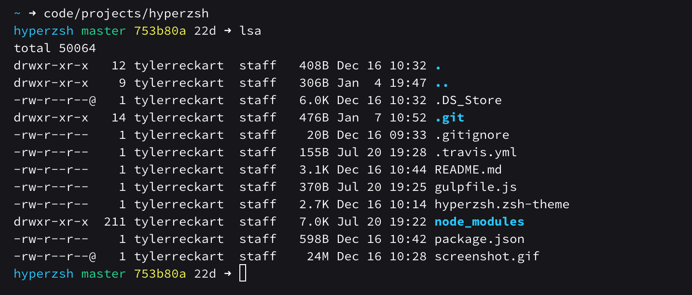

#### H Y P E R Z S H  
[](https://travis-ci.org/tylerreckart/hyperzsh)


Hyperzsh is a [oh-my-zsh](https://github.com/robbyrussell/oh-my-zsh) shell theme that gives you a comprehensive overview of the branch you're working on and the status of your repository throughout the development process without cluttering your terminal.  

If currently shows:  
- Git status
- Timestamp
- Current directory
- [Current SHA](#current_sha)
- Background jobs
- Exit code of last command

## Installation  
### For [antigen](https://github.com/zsh-users/antigen) users
Add `antigen bundle tylerreckart/hyperzsh` to your `.zshrc`. Antigen will clone and load the hyperzsh repository automaticall the next time you start a zsh session.  

### For [oh-my-zsh](http://ohmyz.sh) users  
If you're using oh-my-zsh, follow these steps to install hyperzsh:  
`git clone https://github.com/tylerreckart/hyperzsh`  
`cd hyperzsh && cp -R hyperzsh.zsh-theme ~/.oh-my-zsh/themes/hyperzsh.zsh-theme`  
`vim ~/.zshrc`
Set `ZSH_THEME="current_theme"` to `ZSH_THEME="hyperzsh"`  

### For [Zgen](https://github.com/tarjoilija/zgen) users
Add `zgen load tylerreckart/hyperzsh` to your `.zshrc` with your other `zgen load` statements.  
`zgen save` and zgen will automaticall handle cloning the repository for you.  

## Color schemes  
Hyperzsh was built with Hyper.app in mind. The demo above uses my custom color scheme called [hyperblue](https://github.com/tylerreckart/hyperblue). More recently, I've built [hyperblue-vibrancy](https://github.com/tylerreckart/hyperblue-vibrancy). It brings in the same colorscheme as hyperblue, but leverages the Vibrancy API in macos. the You can automatically configure hyperblue by adding `'hyperblue'` or `'hyperblue-vibrancy'` to the plugins section in `~/.hyper.js`.  

## Options  
Hyperzsh is highly configurable. It was build to seamlessly integrate git into my workflow, but my choices may not work for you. Everything from the icons to colors are customizable to whatever you will. Want to slap some emoji in there? Go for it!

### Show current SHA <a name="current_sha"></a>  

  

If you'd like to view your branch's current SHA, there's already support baked into the theme. All you have to do is edit `hyperzsh.zsh-theme` and comment out the default prompt while uncommenting the prompt that includes the SHA.  

```zsh
# The prompt
# PROMPT='$(_user_host)$(_python_venv)%{$fg[cyan]%}%c $(git_prompt_info)%{$reset_color%}$(git_prompt_short_sha)%{$fg[magenta]%}$(_git_time_since_commit)$(git_prompt_status)${_return_status}➜ '

# Prompt with SHA
PROMPT='$(_user_host)$(_python_venv)%{$fg[cyan]%}%c $(git_prompt_info)%{$reset_color%}$(git_prompt_short_sha)%{$fg[magenta]%}$(_git_time_since_commit)$(git_prompt_status)${_return_status}➜ '
```

### Status Indicators  
| Variable | Indicator | Meaning |
|----------|-----------|---------|
| `ZSH_THEME_GIT_PROMPT_UNTRACKED` | ◒ | Untracked files |
| `ZSH_THEME_GIT_PROMPT_ADDED` | ✓ | Files added to git |
| `ZSH_THEME_GIT_PROMPT_MODIFIED` | △ | Modified files |
| `ZSH_THEME_GIT_PROMPT_DELETED` | ✖ | Deleted files |
| `ZSH_THEME_GIT_PROMPT_RENAMED` | ➜ | Renamed files |
| `ZSH_THEME_GIT_PROMPT_UNMERGED` | § | Unmerged files |
| `ZSH_THEME_GIT_PROMPT_AHEAD` | ▲ | Repo ahead of current branch |
| `ZSH_THEME_GIT_PROMPT_DIRTY` | ✗ | Dirty repository |

### Right hand prompt  
The right hand prompt displays the current branch, time since last commit, as well as commit status of the repository  

| Variable | Branch Color |
|----------|--------------|
| `ZSH_THEME_GIT_TIME_SINCE_COMMIT_SHORT` | Green |
| `ZSH_THEME_GIT_TIME_SINCE_COMMIT_MEDIUM` | Yellow |
| `ZSH_THEME_GIT_TIME_SINCE_COMMIT_LONG`  | Red |
| `ZSH_THEME_GIT_TIME_SINCE_COMMIT_NEUTRAL` | White |

## License
MIT (c) 2016 - 2017 [Tyler Reckart](https://github.com/tylerreckart)
